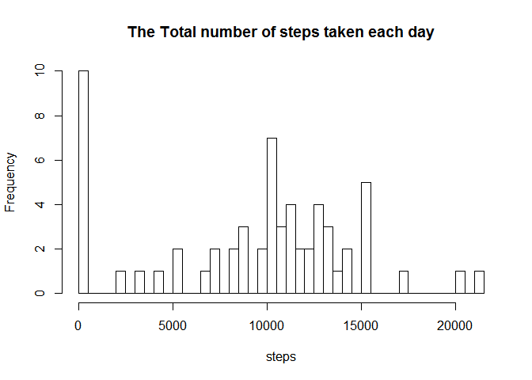
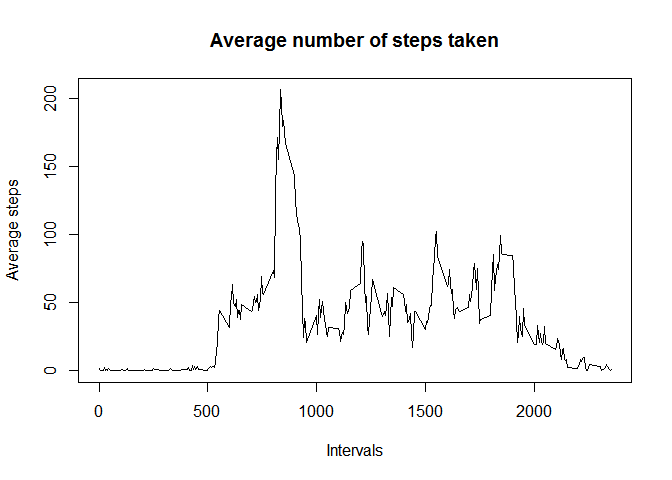
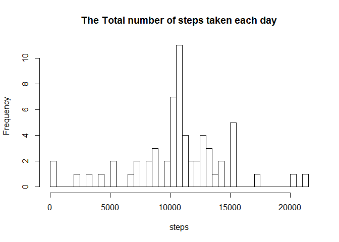
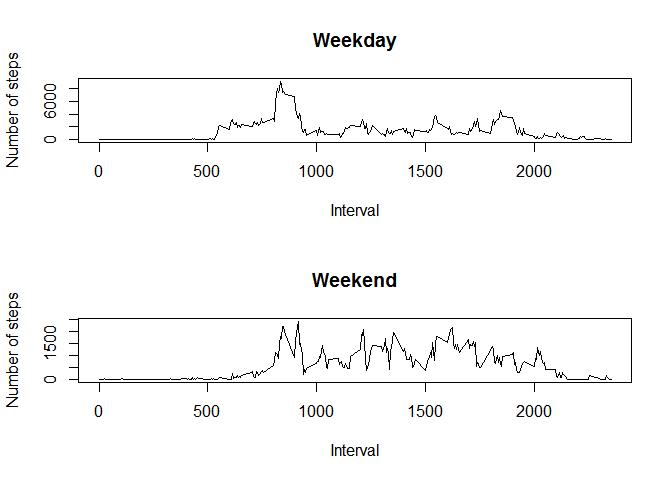

# Reproducible Research: Peer Assessment 1


## Loading and preprocessing the data

```r
input <- read.csv("activity.csv")
input$date <- as.Date(input$date, format="%Y-%m-%d")
head(input)
```

```
##   steps       date interval
## 1    NA 2012-10-01        0
## 2    NA 2012-10-01        5
## 3    NA 2012-10-01       10
## 4    NA 2012-10-01       15
## 5    NA 2012-10-01       20
## 6    NA 2012-10-01       25
```


## What is mean total number of steps taken per day?

```r
aggr <- aggregate(input[c("steps")], by =list(input$date), FUN=sum, na.rm=TRUE)
aggr
```

```
##       Group.1 steps
## 1  2012-10-01     0
## 2  2012-10-02   126
## 3  2012-10-03 11352
## 4  2012-10-04 12116
## 5  2012-10-05 13294
## 6  2012-10-06 15420
## 7  2012-10-07 11015
## 8  2012-10-08     0
## 9  2012-10-09 12811
## 10 2012-10-10  9900
## 11 2012-10-11 10304
## 12 2012-10-12 17382
## 13 2012-10-13 12426
## 14 2012-10-14 15098
## 15 2012-10-15 10139
## 16 2012-10-16 15084
## 17 2012-10-17 13452
## 18 2012-10-18 10056
## 19 2012-10-19 11829
## 20 2012-10-20 10395
## 21 2012-10-21  8821
## 22 2012-10-22 13460
## 23 2012-10-23  8918
## 24 2012-10-24  8355
## 25 2012-10-25  2492
## 26 2012-10-26  6778
## 27 2012-10-27 10119
## 28 2012-10-28 11458
## 29 2012-10-29  5018
## 30 2012-10-30  9819
## 31 2012-10-31 15414
## 32 2012-11-01     0
## 33 2012-11-02 10600
## 34 2012-11-03 10571
## 35 2012-11-04     0
## 36 2012-11-05 10439
## 37 2012-11-06  8334
## 38 2012-11-07 12883
## 39 2012-11-08  3219
## 40 2012-11-09     0
## 41 2012-11-10     0
## 42 2012-11-11 12608
## 43 2012-11-12 10765
## 44 2012-11-13  7336
## 45 2012-11-14     0
## 46 2012-11-15    41
## 47 2012-11-16  5441
## 48 2012-11-17 14339
## 49 2012-11-18 15110
## 50 2012-11-19  8841
## 51 2012-11-20  4472
## 52 2012-11-21 12787
## 53 2012-11-22 20427
## 54 2012-11-23 21194
## 55 2012-11-24 14478
## 56 2012-11-25 11834
## 57 2012-11-26 11162
## 58 2012-11-27 13646
## 59 2012-11-28 10183
## 60 2012-11-29  7047
## 61 2012-11-30     0
```

```r
hist(aggr$steps, main = "The Total number of steps taken each day", 
     xlab = "steps", breaks = 50)
```

 

```r
aggrmean <- aggregate(input[c("steps")], by=list(input$date), FUN=mean,
                  na.rm=TRUE)
aggrmedian <- aggregate(input[c("steps")], by=list(input$date), FUN=median,
                  na.rm=TRUE)
meanMedian <- data.frame(date=aggrmean$Group.1, Mean=aggrmean$steps,    Median=aggrmedian$steps)
names(meanMedian) <- c("date", "mean", "median")
meanMedian
```

```
##          date       mean median
## 1  2012-10-01        NaN     NA
## 2  2012-10-02  0.4375000      0
## 3  2012-10-03 39.4166667      0
## 4  2012-10-04 42.0694444      0
## 5  2012-10-05 46.1597222      0
## 6  2012-10-06 53.5416667      0
## 7  2012-10-07 38.2465278      0
## 8  2012-10-08        NaN     NA
## 9  2012-10-09 44.4826389      0
## 10 2012-10-10 34.3750000      0
## 11 2012-10-11 35.7777778      0
## 12 2012-10-12 60.3541667      0
## 13 2012-10-13 43.1458333      0
## 14 2012-10-14 52.4236111      0
## 15 2012-10-15 35.2048611      0
## 16 2012-10-16 52.3750000      0
## 17 2012-10-17 46.7083333      0
## 18 2012-10-18 34.9166667      0
## 19 2012-10-19 41.0729167      0
## 20 2012-10-20 36.0937500      0
## 21 2012-10-21 30.6284722      0
## 22 2012-10-22 46.7361111      0
## 23 2012-10-23 30.9652778      0
## 24 2012-10-24 29.0104167      0
## 25 2012-10-25  8.6527778      0
## 26 2012-10-26 23.5347222      0
## 27 2012-10-27 35.1354167      0
## 28 2012-10-28 39.7847222      0
## 29 2012-10-29 17.4236111      0
## 30 2012-10-30 34.0937500      0
## 31 2012-10-31 53.5208333      0
## 32 2012-11-01        NaN     NA
## 33 2012-11-02 36.8055556      0
## 34 2012-11-03 36.7048611      0
## 35 2012-11-04        NaN     NA
## 36 2012-11-05 36.2465278      0
## 37 2012-11-06 28.9375000      0
## 38 2012-11-07 44.7326389      0
## 39 2012-11-08 11.1770833      0
## 40 2012-11-09        NaN     NA
## 41 2012-11-10        NaN     NA
## 42 2012-11-11 43.7777778      0
## 43 2012-11-12 37.3784722      0
## 44 2012-11-13 25.4722222      0
## 45 2012-11-14        NaN     NA
## 46 2012-11-15  0.1423611      0
## 47 2012-11-16 18.8923611      0
## 48 2012-11-17 49.7881944      0
## 49 2012-11-18 52.4652778      0
## 50 2012-11-19 30.6979167      0
## 51 2012-11-20 15.5277778      0
## 52 2012-11-21 44.3993056      0
## 53 2012-11-22 70.9270833      0
## 54 2012-11-23 73.5902778      0
## 55 2012-11-24 50.2708333      0
## 56 2012-11-25 41.0902778      0
## 57 2012-11-26 38.7569444      0
## 58 2012-11-27 47.3819444      0
## 59 2012-11-28 35.3576389      0
## 60 2012-11-29 24.4687500      0
## 61 2012-11-30        NaN     NA
```

Note: The mean and median columns above may produce NA's as these days have all the steps as NA.


## What is the average daily activity pattern?


```r
aggrInterval <- aggregate(input[c("steps")], by = list(input$interval), FUN=mean, na.rm=TRUE)
names(aggrInterval) <- c("interval", "steps")
plot(aggrInterval$interval, aggrInterval$steps, type= "l", main = "Average number of steps taken", xlab = "Intervals" , ylab="Average steps" )
```

 

```r
head(aggrInterval, n=50)
```

```
##    interval     steps
## 1         0 1.7169811
## 2         5 0.3396226
## 3        10 0.1320755
## 4        15 0.1509434
## 5        20 0.0754717
## 6        25 2.0943396
## 7        30 0.5283019
## 8        35 0.8679245
## 9        40 0.0000000
## 10       45 1.4716981
## 11       50 0.3018868
## 12       55 0.1320755
## 13      100 0.3207547
## 14      105 0.6792453
## 15      110 0.1509434
## 16      115 0.3396226
## 17      120 0.0000000
## 18      125 1.1132075
## 19      130 1.8301887
## 20      135 0.1698113
## 21      140 0.1698113
## 22      145 0.3773585
## 23      150 0.2641509
## 24      155 0.0000000
## 25      200 0.0000000
## 26      205 0.0000000
## 27      210 1.1320755
## 28      215 0.0000000
## 29      220 0.0000000
## 30      225 0.1320755
## 31      230 0.0000000
## 32      235 0.2264151
## 33      240 0.0000000
## 34      245 0.0000000
## 35      250 1.5471698
## 36      255 0.9433962
## 37      300 0.0000000
## 38      305 0.0000000
## 39      310 0.0000000
## 40      315 0.0000000
## 41      320 0.2075472
## 42      325 0.6226415
## 43      330 1.6226415
## 44      335 0.5849057
## 45      340 0.4905660
## 46      345 0.0754717
## 47      350 0.0000000
## 48      355 0.0000000
## 49      400 1.1886792
## 50      405 0.9433962
```

The Interval that contains the maximum number of average steps is

```r
aggrInterval$interval[which(aggrInterval$steps== max(aggrInterval$steps))]
```

```
## [1] 835
```


## Imputing missing values

The total number of missingvalues include

```r
sum(is.na(input$steps))
```

```
## [1] 2304
```


using the mean of the 5-minutes interval for imputing missing values

```r
newdata <- input
for(i in 1:nrow(input)) {
    if(is.na(newdata$steps[i])) {
        newdata$steps[i] <- aggrInterval$steps[which(aggrInterval$interval == newdata$interval[i])]
    }    
}
```

Calculating the sum of steps taken for the newly created dataset.

```r
newsum <- aggregate(newdata[c("steps")], by =list(newdata$date), FUN=sum, na.rm=TRUE)
newsum
```

```
##       Group.1    steps
## 1  2012-10-01 10766.19
## 2  2012-10-02   126.00
## 3  2012-10-03 11352.00
## 4  2012-10-04 12116.00
## 5  2012-10-05 13294.00
## 6  2012-10-06 15420.00
## 7  2012-10-07 11015.00
## 8  2012-10-08 10766.19
## 9  2012-10-09 12811.00
## 10 2012-10-10  9900.00
## 11 2012-10-11 10304.00
## 12 2012-10-12 17382.00
## 13 2012-10-13 12426.00
## 14 2012-10-14 15098.00
## 15 2012-10-15 10139.00
## 16 2012-10-16 15084.00
## 17 2012-10-17 13452.00
## 18 2012-10-18 10056.00
## 19 2012-10-19 11829.00
## 20 2012-10-20 10395.00
## 21 2012-10-21  8821.00
## 22 2012-10-22 13460.00
## 23 2012-10-23  8918.00
## 24 2012-10-24  8355.00
## 25 2012-10-25  2492.00
## 26 2012-10-26  6778.00
## 27 2012-10-27 10119.00
## 28 2012-10-28 11458.00
## 29 2012-10-29  5018.00
## 30 2012-10-30  9819.00
## 31 2012-10-31 15414.00
## 32 2012-11-01 10766.19
## 33 2012-11-02 10600.00
## 34 2012-11-03 10571.00
## 35 2012-11-04 10766.19
## 36 2012-11-05 10439.00
## 37 2012-11-06  8334.00
## 38 2012-11-07 12883.00
## 39 2012-11-08  3219.00
## 40 2012-11-09 10766.19
## 41 2012-11-10 10766.19
## 42 2012-11-11 12608.00
## 43 2012-11-12 10765.00
## 44 2012-11-13  7336.00
## 45 2012-11-14 10766.19
## 46 2012-11-15    41.00
## 47 2012-11-16  5441.00
## 48 2012-11-17 14339.00
## 49 2012-11-18 15110.00
## 50 2012-11-19  8841.00
## 51 2012-11-20  4472.00
## 52 2012-11-21 12787.00
## 53 2012-11-22 20427.00
## 54 2012-11-23 21194.00
## 55 2012-11-24 14478.00
## 56 2012-11-25 11834.00
## 57 2012-11-26 11162.00
## 58 2012-11-27 13646.00
## 59 2012-11-28 10183.00
## 60 2012-11-29  7047.00
## 61 2012-11-30 10766.19
```

```r
hist(newsum$steps, main = "The Total number of steps taken each day", 
     xlab = "steps", breaks = 50)
```

 
* Imputing missing values has the effect of normalizing the distribution as it can be seen from the histigram

Calculating mean and median for the new Dataset.

```r
newmean <- aggregate(newdata[c("steps")], by=list(newdata$date), FUN=mean,
                  na.rm=TRUE)
newmedian <- aggregate(newdata[c("steps")], by=list(newdata$date), FUN=median,
                  na.rm=TRUE)
newmeanMedian <- data.frame(date=newmean$Group.1, Mean=newmean$steps,    Median=newmedian$steps)
names(newmeanMedian) <- c("date", "mean", "median")
newmeanMedian
```

```
##          date       mean   median
## 1  2012-10-01 37.3825996 34.11321
## 2  2012-10-02  0.4375000  0.00000
## 3  2012-10-03 39.4166667  0.00000
## 4  2012-10-04 42.0694444  0.00000
## 5  2012-10-05 46.1597222  0.00000
## 6  2012-10-06 53.5416667  0.00000
## 7  2012-10-07 38.2465278  0.00000
## 8  2012-10-08 37.3825996 34.11321
## 9  2012-10-09 44.4826389  0.00000
## 10 2012-10-10 34.3750000  0.00000
## 11 2012-10-11 35.7777778  0.00000
## 12 2012-10-12 60.3541667  0.00000
## 13 2012-10-13 43.1458333  0.00000
## 14 2012-10-14 52.4236111  0.00000
## 15 2012-10-15 35.2048611  0.00000
## 16 2012-10-16 52.3750000  0.00000
## 17 2012-10-17 46.7083333  0.00000
## 18 2012-10-18 34.9166667  0.00000
## 19 2012-10-19 41.0729167  0.00000
## 20 2012-10-20 36.0937500  0.00000
## 21 2012-10-21 30.6284722  0.00000
## 22 2012-10-22 46.7361111  0.00000
## 23 2012-10-23 30.9652778  0.00000
## 24 2012-10-24 29.0104167  0.00000
## 25 2012-10-25  8.6527778  0.00000
## 26 2012-10-26 23.5347222  0.00000
## 27 2012-10-27 35.1354167  0.00000
## 28 2012-10-28 39.7847222  0.00000
## 29 2012-10-29 17.4236111  0.00000
## 30 2012-10-30 34.0937500  0.00000
## 31 2012-10-31 53.5208333  0.00000
## 32 2012-11-01 37.3825996 34.11321
## 33 2012-11-02 36.8055556  0.00000
## 34 2012-11-03 36.7048611  0.00000
## 35 2012-11-04 37.3825996 34.11321
## 36 2012-11-05 36.2465278  0.00000
## 37 2012-11-06 28.9375000  0.00000
## 38 2012-11-07 44.7326389  0.00000
## 39 2012-11-08 11.1770833  0.00000
## 40 2012-11-09 37.3825996 34.11321
## 41 2012-11-10 37.3825996 34.11321
## 42 2012-11-11 43.7777778  0.00000
## 43 2012-11-12 37.3784722  0.00000
## 44 2012-11-13 25.4722222  0.00000
## 45 2012-11-14 37.3825996 34.11321
## 46 2012-11-15  0.1423611  0.00000
## 47 2012-11-16 18.8923611  0.00000
## 48 2012-11-17 49.7881944  0.00000
## 49 2012-11-18 52.4652778  0.00000
## 50 2012-11-19 30.6979167  0.00000
## 51 2012-11-20 15.5277778  0.00000
## 52 2012-11-21 44.3993056  0.00000
## 53 2012-11-22 70.9270833  0.00000
## 54 2012-11-23 73.5902778  0.00000
## 55 2012-11-24 50.2708333  0.00000
## 56 2012-11-25 41.0902778  0.00000
## 57 2012-11-26 38.7569444  0.00000
## 58 2012-11-27 47.3819444  0.00000
## 59 2012-11-28 35.3576389  0.00000
## 60 2012-11-29 24.4687500  0.00000
## 61 2012-11-30 37.3825996 34.11321
```

* The mean and median values of the newly created dataset doesn't deviate from the first part of the assignment.


## Are there differences in activity patterns between weekdays and weekends?

Calculating whether wekday or weekend. and plotting the interval mean plot.

```r
week <- vector(mode="character", length = nrow(input))
for(i in 1:nrow(input)) {
    date <- as.Date(input$date[i],format="%Y-%m-%d" )
    if(weekdays(date)=="Saturday" || weekdays(date)=="Sunday") {
        week[i] <- "weekend"
    
    }
    else
        week[i] <- "weekday"
    
}
updatedframe <- data.frame(input, week)
par(mfrow = c(2,1))
day <- subset(updatedframe, updatedframe$week=="weekday")
end <- subset(updatedframe, updatedframe$week=="weekend")
dayaggr <- aggregate(day[c("steps")], by=list(day$interval), FUN=sum,na.rm=TRUE)
endaggr <- aggregate(end[c("steps")], by=list(end$interval), FUN=sum,na.rm=TRUE)
plot(dayaggr$Group.1,dayaggr$steps , type="l", ylab = "Number of steps", main = "Weekday", xlab="Interval")
plot(endaggr$Group.1,endaggr$steps , type="l", ylab = "Number of steps", main = "Weekend", xlab = "Interval")
```

 


